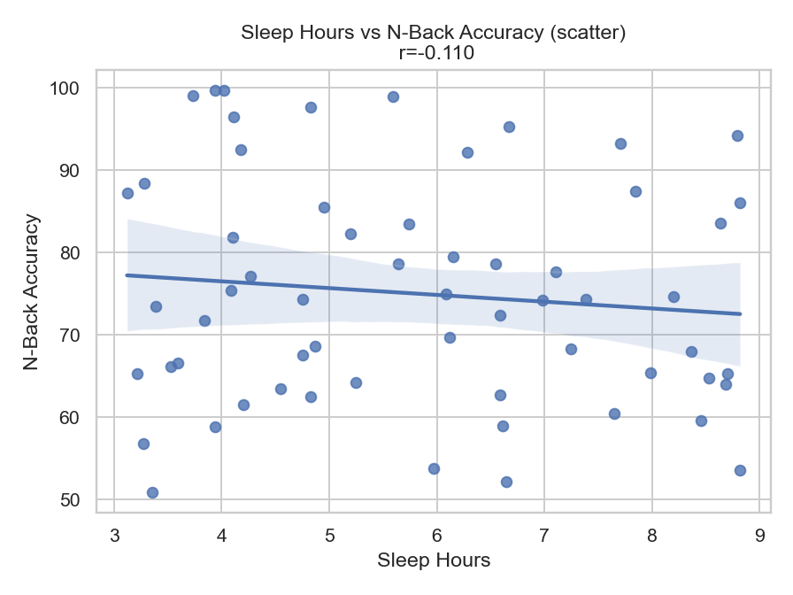
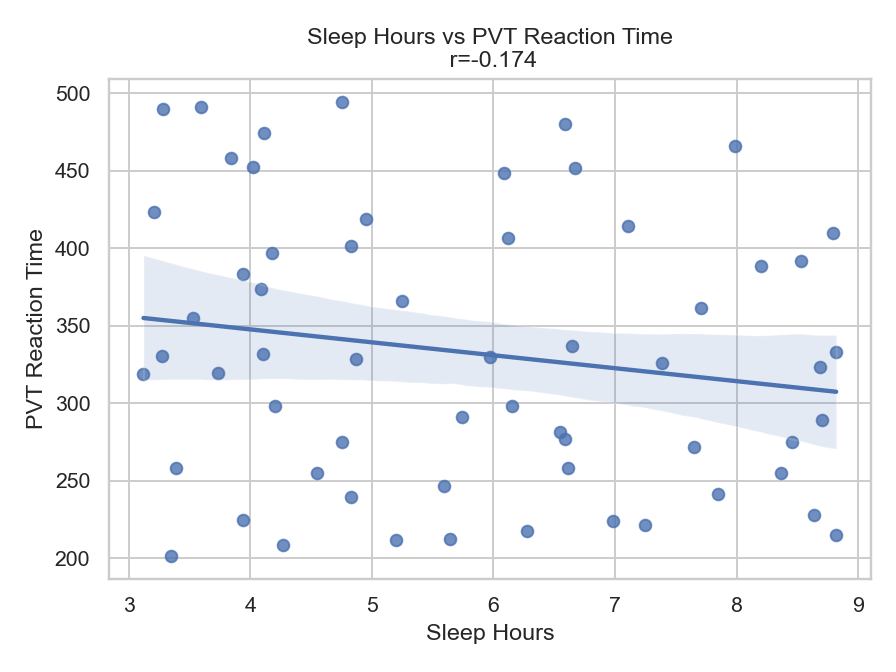
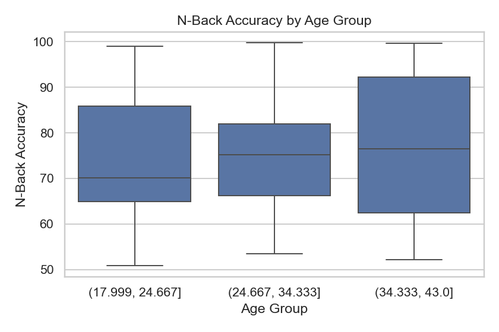

# Sleep Hours and Cognitive Performance Analysis  

## Dataset  
- File: `sleep_deprivation_dataset_detailed.csv`  
- 60 participants, 14 variables (sleep, cognitive tasks, lifestyle measures).  

## Methods  
- Data exploration with **pandas**  
- Visualizations with **seaborn** and **matplotlib**  
- Descriptive statistics  
- Correlation analysis (Pearson)  
- Multiple regression (NumPy implementation)  
- Subgroup comparisons (gender, age groups)  

## Results (Main)  

### Sleep Hours distribution


### Sleep Hours vs N-Back Accuracy (scatter)


### Linear Trend (regression)


**Correlation Sleep_Hours vs N_Back_Accuracy = -0.118**  

## Interpretation (Main)  

There is a very weak negative correlation between sleep hours and N-Back accuracy (r = -0.118).  
This indicates that participants who slept slightly less did not systematically perform worse on the working memory task.  
The effect size is so small that it is likely explained by random variation rather than a meaningful trend.  

This suggests that, in this dataset, sleep duration alone does not have a strong impact on working memory performance.  
It is possible that other variables — such as sleep quality, stress levels, or individual differences in cognitive capacity — play a more important role.  
Therefore, while sleep is crucial for overall cognitive health, this analysis shows that its direct effect on short-term working memory (as measured by the N-Back task) may be limited in this sample.  

---

## Additional Results  

### Sleep Hours vs Stroop Reaction Time


### Sleep Hours vs PVT Reaction Time


### Sleep Hours vs N-Back Accuracy (check)


### N-Back Accuracy by Gender


### N-Back Accuracy by Age Group


### Partial effect of Sleep Hours (Multiple Regression)


**Multiple regression summary:** see `results/ols_summary.txt`.  

---

## Interpretation (Complete)  

**Global pattern.** The relationship between **sleep duration** and **working-memory performance** (N-Back accuracy) remains **very weak**. The simple correlation (r ≈ -0.12) suggests that more sleep is **not** clearly associated with higher accuracy in this sample.  

**Reaction-time tasks (Stroop / PVT).** Plots for **Stroop** and **PVT** do not show a strong linear trend with sleep hours. Small tendencies may appear, but the **effect sizes are minimal**, which means day-to-day noise or individual differences likely dominate these outcomes.  

**Subgroups (gender / age).** The **gender** barplot and **age-group** boxplot show **small differences** in average N-Back accuracy across groups, but visually these gaps look modest. Without formal tests (t-test/ANOVA), we should treat them as **suggestive only**.  

**Multiple regression (sleep + covariates).** A multivariable model including **Sleep_Hours**, and available covariates (e.g., **Sleep_Quality**, **Caffeine_Intake**, **Stress_Level**, **Age**, **Gender**) yields a **low R²** (see `results/ols_summary.txt`). This indicates that **sleep duration alone is a weak predictor**, and even combined with a few simple covariates it explains **limited variance** in N-Back accuracy.  

**Takeaway.** In this dataset, **sleep quantity** by itself is a **poor predictor** of working-memory performance. Factors such as **sleep quality**, **stress**, **habitual caffeine**, or stable **individual differences** may matter more than hours slept the previous night. Results should be interpreted as **descriptive**, not causal.  

---

## How to Run  
```bash
pip install pandas seaborn matplotlib  
python3 analyse_v2.py  
