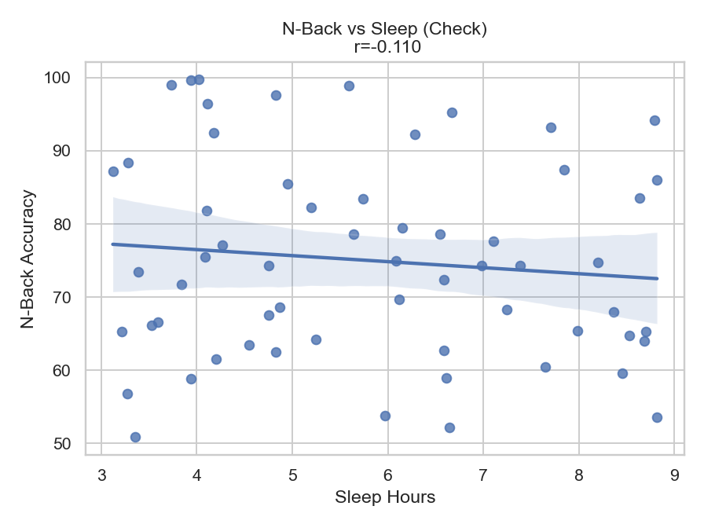

# Sleep Hours and Cognitive Performance Analysis  

## About / Context  
This project explores the relationship between **sleep duration** and **cognitive performance**.  
Using a dataset of 60 participants, it investigates whether the number of hours slept the previous night has a measurable effect on **working memory** (N-Back task accuracy), **reaction times** (Stroop & PVT), and subgroup differences (gender, age).  

The goal is not only to practice **data analysis and visualization in Python**, but also to illustrate how sleep — a key factor in mental health and daily functioning — may (or may not) directly influence short-term cognitive tasks.  

---

## Dataset  
- File: `sleep_deprivation_dataset_detailed.csv`  
- 60 participants, 14 variables (sleep, cognitive tasks, lifestyle measures).  

## Methods  
- Data exploration with **pandas**  
- Visualizations with **seaborn** and **matplotlib**  
- Descriptive statistics  
- Correlation analysis (Pearson)  
- Multiple regression (NumPy implementation)  
- Subgroup comparisons (gender, age groups)  

---

## Results (Main)  

### Sleep Hours distribution


### Sleep Hours vs N-Back Accuracy (scatter)


### Linear Trend (regression)


**Correlation Sleep_Hours vs N_Back_Accuracy = -0.118**  

---

## Interpretation (Main)  

There is a very weak negative correlation between sleep hours and N-Back accuracy (r = -0.118).  
This indicates that participants who slept slightly less did not systematically perform worse on the working memory task.  
The effect size is so small that it is likely explained by random variation rather than a meaningful trend.  

This suggests that, in this dataset, sleep duration alone does not have a strong impact on working memory performance.  
It is possible that other variables — such as sleep quality, stress levels, or individual differences in cognitive capacity — play a more important role.  
Therefore, while sleep is crucial for overall cognitive health, this analysis shows that its direct effect on short-term working memory (as measured by the N-Back task) may be limited in this sample.  

---

## Additional Results  

### Reaction Time Tasks
<p align="center">
  <figure style="display:inline-block; margin:10px;">
    <figcaption align="center"><b>Sleep Hours vs Stroop Task Reaction Time</b></figcaption>
    
  </figure>
  <figure style="display:inline-block; margin:10px;">
    <figcaption align="center"><b>Sleep Hours vs PVT Reaction Time</b></figcaption>
    
  </figure>
</p>

**Interpretation.** Both Stroop and PVT reaction times show no clear linear trend with sleep hours.  
Effect sizes are minimal, suggesting that variability is driven more by day-to-day noise or individual differences than by sleep duration.  

---

### N-Back Accuracy Checks
<p align="center">
  <figure style="display:inline-block; margin:10px;">
    <figcaption align="center"><b>N-Back vs Sleep (Check)</b></figcaption>
    
  </figure>
  <figure style="display:inline-block; margin:10px;">
    <figcaption align="center"><b>N-Back Accuracy by Gender</b></figcaption>
    
  </figure>
</p>

**Interpretation.** The N-Back vs Sleep “check” plot confirms the weak and inconsistent relationship seen earlier.  
The gender barplot shows small mean differences between male and female participants, but these gaps are modest and should be considered exploratory.  

---

### Age and Regression Effects
<p align="center">
  <figure style="display:inline-block; margin:10px;">
    <figcaption align="center"><b>N-Back Accuracy by Age Group</b></figcaption>
    
  </figure>
  <figure style="display:inline-block; margin:10px;">
    <figcaption align="center"><b>Partial Sleep Effect (Regression)</b></figcaption>
    
  </figure>
</p>

**Interpretation.** The boxplot indicates slight variability in N-Back performance across age groups, though differences remain small.  
The partial regression plot (NumPy OLS) shows that, even after adjusting for covariates (sleep quality, stress, caffeine, age, gender), sleep hours explain very little variance in N-Back accuracy.  

---

**Multiple regression summary:** see `results/ols_summary.txt`.  

---

## Interpretation (Complete)  

**Global pattern.** The relationship between **sleep duration** and **working-memory performance** (N-Back accuracy) remains **very weak**. The simple correlation (r ≈ -0.12) suggests that more sleep is **not** clearly associated with higher accuracy in this sample.  

**Reaction-time tasks (Stroop / PVT).** Plots for **Stroop** and **PVT** do not show a strong linear trend with sleep hours. Small tendencies may appear, but the **effect sizes are minimal**, which means day-to-day noise or individual differences likely dominate these outcomes.  

**Subgroups (gender / age).** The **gender** barplot and **age-group** boxplot show **small differences** in average N-Back accuracy across groups, but visually these gaps look modest. Without formal tests (t-test/ANOVA), we should treat them as **suggestive only**.  

**Multiple regression (sleep + covariates).** A multivariable model including **Sleep_Hours**, and available covariates (e.g., **Sleep_Quality**, **Caffeine_Intake**, **Stress_Level**, **Age**, **Gender**) yields a **low R²** (see `results/ols_summary.txt`). This indicates that **sleep duration alone is a weak predictor**, and even combined with a few simple covariates it explains **limited variance** in N-Back accuracy.  

**Takeaway.** In this dataset, **sleep quantity** by itself is a **poor predictor** of working-memory performance. Factors such as **sleep quality**, **stress**, **habitual caffeine**, or stable **individual differences** may matter more than hours slept the previous night. Results should be interpreted as **descriptive**, not causal.  

---

## How to Run  
```bash
pip install pandas seaborn matplotlib  
python3 analyse_v2.py  
```
---

## Technologies

- **Python 3.10+** → main programming language used for the analysis.  
- **pandas** → data handling and exploration (CSV loading, cleaning, column manipulation).  
- **matplotlib** → figure creation and saving (style control, titles, sizes, export to `.png`).  
- **seaborn** → statistical visualizations (histograms, scatterplots, boxplots, barplots with error bars).  
- **numpy** → numerical computations (Pearson correlation, linear regression with `lstsq`, vector/matrix operations).  

---


## License
This project is released under the MIT License.

---

## Author
Project by [malou-tp-data](https://github.com/malou-tp-data)

